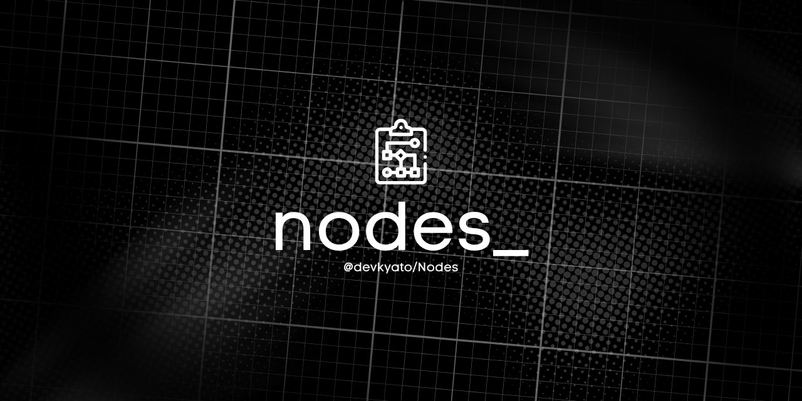

# ◈ Nodes — Private Flowcharts



[](https://github.com/devkyato/Nodes/actions/workflows/ci.yml)
[](https://nodesss.xyz/)
[](LICENSE)

A compact, browser-based flowchart editor built with HTML, vanilla JavaScript, SVG, Tailwind CSS, and FlyonUI. The published app has no runtime services, sends no diagram data to a server, and keeps projects private to the browser.

[✨ Open Nodes](https://nodesss.xyz/)

Built and maintained by [@dev.mako](https://github.com/devkyato) (`devkyato`). I made this as a practical, private diagram tool: fast enough to open for a five-minute sketch, capable enough to keep using when the flow gets real, and simple enough to understand without a manual.

## ✨ Highlights

- Twelve standard flowchart symbols with accurate SVG geometry
- A local home workspace for creating, finding, duplicating, and deleting multiple flowcharts
- Direct multiline text editing and standalone text
- Straight, orthogonal, and curved connectors that stay attached
- Multi-selection, alignment, distribution, grouping, and layer controls
- Draw.io-inspired selection handles plus contextual edit, copy, lock, and delete actions
- Pointer, keyboard, zoom, pan, resize, copy, paste, undo, and redo support
- Local browser saving plus portable JSON project files
- Automatic local drafts plus structured XML project import and export
- Clean SVG and PNG export cropped to the diagram bounds
- Responsive light and dark themes with subtle premium shine and reduced-motion support
- FlyonUI-powered dropdowns, tabs, cards, switches, selects, modals, badges, alerts, and command surfaces
- Searchable shape palette, searchable command menu, and a persistent Settings center

## 🚀 Use locally

Install the development dependencies and start the local server:

```bash
npm install
npm start
```

Then open `http://127.0.0.1:4173`.

## ⌨️ Essential controls

| Action | Control |
| --- | --- |
| Select multiple | Shift + click or drag a selection rectangle |
| Pan | Hold Space and drag |
| Zoom | Ctrl/Cmd + mouse wheel |
| Edit text | Double-click a shape, label, or standalone text |
| Edit selected shape | Enter or use the contextual Edit action |
| Lock / unlock | Select one shape and use the contextual Lock action |
| Add standalone text | Double-click empty canvas or use Text |
| Move precisely | Arrow keys; hold Shift for 10 px |
| Duplicate | Ctrl/Cmd + D |
| Copy / paste | Ctrl/Cmd + C / Ctrl/Cmd + V |
| Undo / redo | Ctrl/Cmd + Z / Ctrl/Cmd + Shift + Z |
| Finish text editing | Click outside or Ctrl/Cmd + Enter |
| Cancel text editing | Escape |
| Open command menu | Ctrl/Cmd + K |

## 📁 Project files

```text
index.html          Local project library and home page
editor.html         Flowchart editor structure
home.js             Multi-project local browser storage
style.css           Interface and responsive styling
script.js           State, rendering, interaction, persistence, export
src/flyon.css       Tailwind and FlyonUI build entrypoint
scripts/            Dependency-free local server and build packaging
tests/              Headless-browser workflow verification
.github/            Manual CI, releases, and contribution templates
docs/               Architecture and release notes for maintainers
```

## ✅ Quality checks

```bash
npm test
npm run build
```

The browser smoke suite exercises themes, FlyonUI settings, command search, menus, modals, locking, rendering, connectors, zoomed dragging, resizing, text editing, history, local persistence, XML/JSON projects, and SVG/PNG export.

## 🔒 Privacy

Projects and personal editor settings remain in the browser unless the user downloads or imports a file. The application has no analytics, accounts, API calls, or remote storage.

## 👋 Maintainer

I’m [@dev.mako](https://github.com/devkyato). If this tool saves you time, star the repository, share the live editor, or open a focused issue with an idea that would make real diagram work smoother.

## Contributing

See [CONTRIBUTING.md](CONTRIBUTING.md). Usage help is in [SUPPORT.md](SUPPORT.md), and security reports should follow [SECURITY.md](SECURITY.md).

## License

[MIT](LICENSE)
